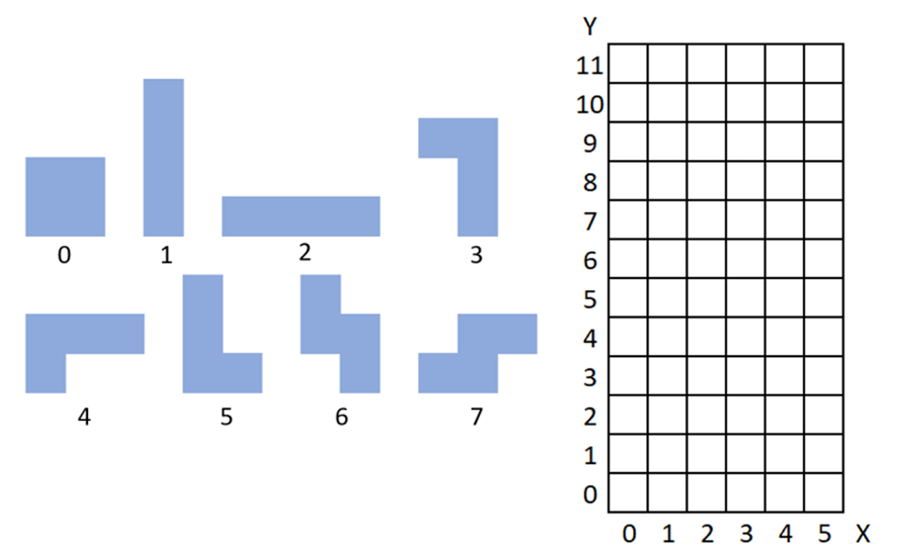
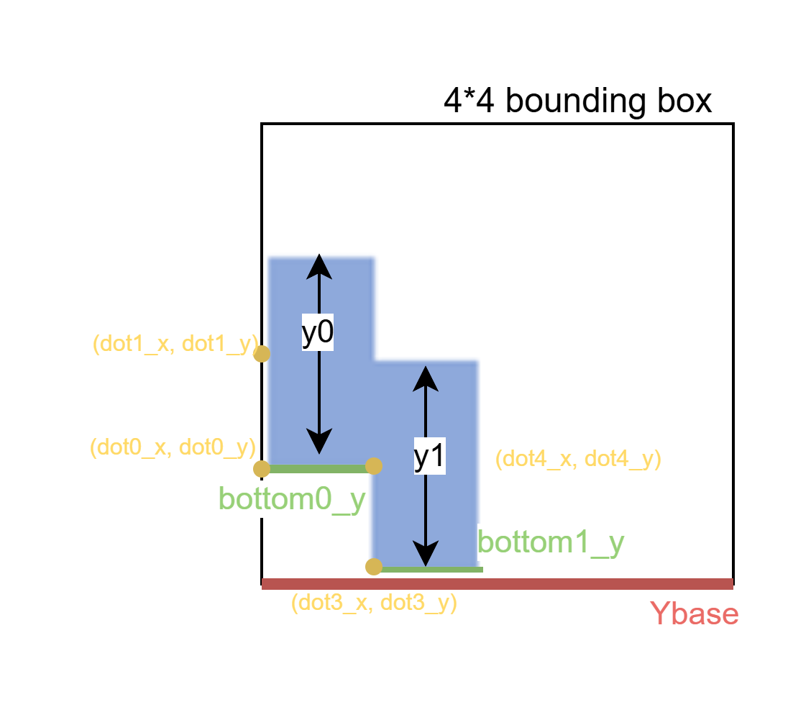

# Lab3 TETRIS and PATTERN Design

## Part 1: TETRIS.v Design

###  Module Overview

The TETRIS module receives one tetromino input at a time (tetromino, position) and updates a 6-column playfield.
It outputs score-related signals every clear stage, and outputs final board data only when the game ends without fail.

### I/O Ports

| Port | Dir | Width | Description |
|---|---|---:|---|
| `rst_n` | In | `1` | Active-low reset. |
| `clk` | In | `1` | System clock. |
| `in_valid` | In | `1` | Input valid for one tetromino command. |
| `tetrominoes` | In | `[2:0]` | Tetromino type code (`0~7`). |
| `position` | In | `[2:0]` | Left anchor x-position (`0~5`) used for placement. |
| `tetris_valid` | Out | `1` | Final board valid flag. Asserted only at game end when `fail = 0`. |
| `score_valid` | Out | `1` | Score/fail output valid in CLEAR stage. |
| `fail` | Out | `1` | Overflow/game-over indicator. |
| `score` | Out | `[3:0]` | Accumulated cleared-line score. |
| `tetris` | Out | `[71:0]` | Packed 12x6 board snapshot at valid final output. |


###  View of Board and type Tetrominoes




### Register Definition and Formula



Variables example in tetromino type 6:
- Yi (i = 0, 1, 2, 3) : Candidate landing Y-coordinates for the tetromino base in each column.
- Ybase : Reference Y-coordinate of the $4 \times 4$ bounding box.
- bottom_i_y (i = 0, 1, 2, 3) : Vertical offset from the $Y_{base}$ to the first occupied block in column $i$.
- yi (i = 0, 1, 2, 3) : The effective height (thickness) of the tetromino in column $i$.
- doti_x, doti_y (i = 0, 1, 2, 3) : Coordinates of the i-th block in the tetromino.


Formulas:
1. Formula for calculating the drop position:
```
	Yi = top[x+i] - bottom_i_y, for i = 0, 1, 2, 3
	Ybase = Max(Y0, Y1, Y2, Y3)
```    

2. Formula for updating top in DROP stage:
```
	top[i] = Ybase + yi + bottom_i_y
```

### Implementation Notes

1. Signed and unsigned arithmetic must be aligned with explicit signed extension.

```verilog
top[p_reg] <= Ybase + $signed({1'b0, y0}) + $signed({1'b0, bottom0_y});
```

2. When comparing against signed values, use signed literals (`'sd`) instead of unsigned (`'d`).

```verilog
((top[0] - $signed({1'b0, lines_cleared})) > 5'sd12)
```

3. Watch out for map out-of-bounds conditions. Even though the visible board is rows `0~11`, the implementation allocates 4 extra rows (`0~15`) to avoid overflow in intermediate cycles between DROP and CLEAR, especially when a new piece has just been dropped and has not been compacted yet.
```verilog
// reg [5:0] map [0:11];	
reg [5:0] map [0:15];	
```


## Part 2: PATTERN.v Design

### SPEC-4 to SPEC-8 Verification Checklist

The PATTERN testbench checks the following five requirements:

1. SPEC-4 (Reset behavior)
- The reset signal (`rst_n`) is asserted only once at the beginning of simulation.
- All output signals must be reset correctly.
- The checker samples outputs 100 ns after `rst_n` is pulled low.

2. SPEC-5 (Output-zero constraints when valid is low)
- `score`, `fail`, and `tetris_valid` must be `0` when `score_valid` is low.
- `tetris` must be reset to `0` when `tetris_valid` is low.

3. SPEC-6 (Latency limit)
- Each input set must complete within 1000 cycles.
- Latency is defined as the cycle count between:
	the falling edge of `in_valid` and the rising edge of `score_valid`.

4. SPEC-7 (Correctness of functional outputs)
- When `score_valid` is high, `score` and `fail` must match the golden result.
- When `tetris_valid` is high, `tetris` must match the golden board.

5. SPEC-8 (Valid pulse width)
- `score_valid` and `tetris_valid` cannot stay high for more than 1 cycle.
- Both signals must be deasserted in the immediate next cycle.

### Golden Model Note

The golden-board/golden-score calculation in this PATTERN is directly reused from an existing reference implementation by the original author.
