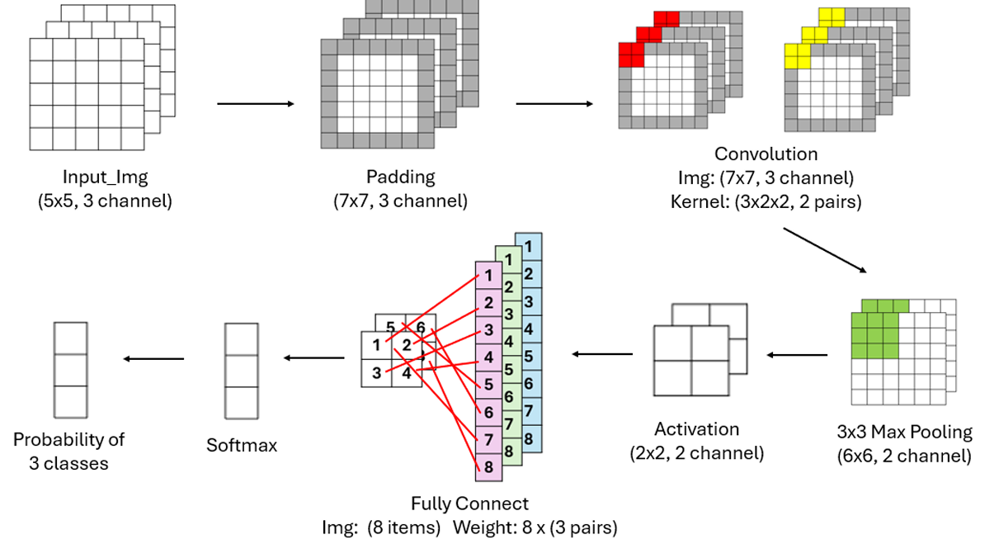
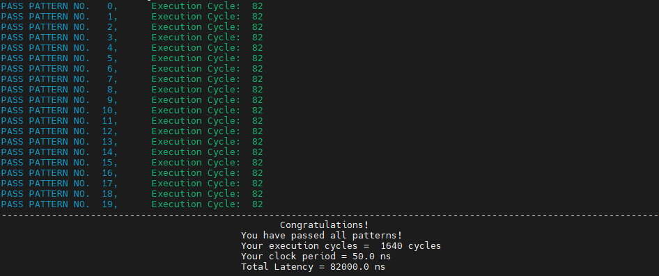

# Lab 4: CNN

## Module Overview

This lab implements a IEEE754 based floating-point CNN inference pipeline with the following stages:



The RTL uses IEEE-754 single-precision floating-point data and DesignWare floating-point IPs for multiplication, addition, comparison, exponential, and division.

## I/O Ports

| Port | Dir | Width | Description |
|---|---|---:|---|
| `clk` | In | `1` | System clock. |
| `rst_n` | In | `1` | Active-low reset. |
| `in_valid` | In | `1` | Input valid. |
| `Img` | In | `[31:0]` | Floating-point image pixel input. |
| `Kernel_ch1` | In | `[31:0]` | Floating-point kernel value for kernel 1. |
| `Kernel_ch2` | In | `[31:0]` | Floating-point kernel value for kernel 2. |
| `Weight` | In | `[31:0]` | Floating-point fully connected weight input. |
| `Opt` | In | `1` | Operation option. `0`: zero padding + sigmoid, `1`: replication padding + tanh. |
| `out_valid` | Out | `1` | Output valid. |
| `out` | Out | `[31:0]` | Floating-point softmax result. |

## State Flow

The FSM is:

`Input_R -> Input_G -> Input_B -> Padding -> Convolution -> MaxPooling -> Activation -> FullyConnected -> Softmax -> OUT`

## Internal Data Organization

### Image / Feature Map Storage

- `imgR[0:6][0:6]`, `imgG[0:6][0:6]`, `imgB[0:6][0:6]`
  - During input stage, they store the padded RGB image.
  - During convolution stage, `imgR` and `imgG` are reused to store the two convolution output maps.

### Kernel Storage

- `kernel1_R/G/B[0:3]`
- `kernel2_R/G/B[0:3]`

Each kernel is `2x2`, and each RGB channel has 4 values.

### Fully Connected Weights

- `weight1[0:7]`
- `weight2[0:7]`
- `weight3[0:7]`

Each output neuron uses 8 weights, so there are 24 weights in total.

### Intermediate Buffers

- `pixel_buffer[0:7]`
  - Stores 8 max-pooled values.
  - Then stores the corresponding activation outputs.
- `fc_buffer[0:2]`
  - Stores the 3 fully connected outputs.
- `softmax_buffer[0:2]`
  - Stores the 3 final softmax outputs before `OUT`.

## Design Concept

### 1. Convolution

The convolution stage uses:

- 24 floating-point multipliers
- 22 floating-point adders

For each sliding window:

- each kernel computes `4 positions x 3 channels`
- each position accumulates `R + G + B`
- then the 4 position sums are reduced into one final convolution output

Two kernels are computed in parallel and written back to:

- `imgR[y][x]` for kernel 1
- `imgG[y][x]` for kernel 2

### 2. Max Pooling

Each `6x6` feature map is max-pooled using a `3x3` window and stride `3`.

So each feature map becomes `2x2`, and the total pooled outputs are:

- 4 from kernel 1
- 4 from kernel 2

These 8 values are stored in `pixel_buffer[0:7]`.

### 3. Activation

The activation stage is implemented sequentially to reduce the timing burden of floating-point division.

$$
\text{sigmoid}(x) = \frac{1}{1 + e^{-x}}
$$  
$$
\text{tanh}(x) = \frac{1 - e^{-2x}}{1 + e^{-2x}}
$$

`Activation_module` uses DesignWare:

- `DW_fp_exp`
- `DW_fp_add`
- `DW_lp_piped_fp_div`


### 4. Fully Connected

The fully connected layer reuses:

- the 24 multipliers already used in convolution
- adders `inst0 ~ inst7` from the convolution adder structure

Instead of instantiating another independent FC adder tree, the design uses a shared combinational mux block:

- `Convolution` state: shared adders are connected to convolution partial sums
- `FullyConnected` state: shared adders are connected to FC partial products

Three FC outputs are generated over 3 cycles and stored into `fc_buffer[0:2]`.

### 5. Softmax

Softmax is implemented as:

$$
\text{softmax}(z_i)=\frac{e^{z_i}}{e^{z_1}+e^{z_2}+e^{z_3}}
$$

Implementation flow:

1. Reuse one `DW_fp_exp` to compute `exp(z0)`, `exp(z1)`, `exp(z2)` sequentially.
2. Use two floating-point adders to form the denominator.
3. Use one `DW_lp_piped_fp_div` to divide each numerator by the shared denominator.
4. Use `launch_id` / `arrive_id` to write results back to the correct `softmax_buffer` slot.

## Execution Cycle

This implementation passes the pattern with an execution latency of `82 cycles`.




## Implementation Notes

1. DesignWare floating-point modules must be instantiated with correct FP32 parameters.  
Using default parameters may silently fall back to the wrong width and corrupt the result.
```
DW_fp_add #(
  inst_sig_width, inst_exp_width, inst_ieee_compliance
) DW_fp_add_inst8 (.a(k1_final_conv0), .b(k1_final_conv1), .rnd(3'b000), .z(k1_final_conv_sum0));
```

2. Floating-point sign inversion can be done by flipping only the sign bit.  
For IEEE-754 single precision, `-x` can be written as 
```
{~x[31], x[30:0]}
```
