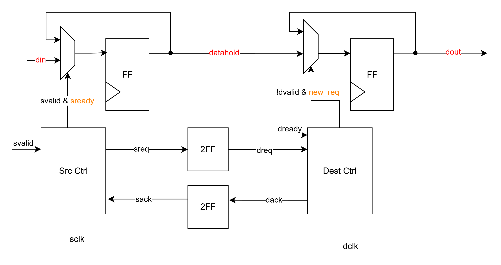

# Lab7 - Convolution with Clock Domain Crossing

This lab focuses on clock domain crossing (CDC) design. The system receives input data in `clk1`, transfers it to `clk2` through a handshake synchronizer for convolution, and sends the output data back to `clk1` through an asynchronous FIFO.

## Source Note

The `PATTERN`, `CONV_TOP`, `DESIGN_module`, and generated test data are AI-assisted generated. My main implementation and study focus is the synchronizer part:

- `Handshake_syn.v`
- `FIFO_syn.v`

## Handshake Synchronizer



The handshake synchronizer transfers one stable multi-bit data word from the source clock domain to the destination clock domain. It is a toggle-based request / acknowledge protocol: `sreq` toggles when the source sends a new data word, and `dack` is updated to match the received request after the destination accepts the data. Instead of synchronizing every data bit directly, the source holds the data stable in `dhold`, and only the request / acknowledge control signals cross clock domains through 2FF synchronizers.

### Handshake IO Ports

| Port | Direction | Clock Domain | Width | Description |
| --- | --- | --- | --- | --- |
| `sclk` | input | source | 1 | Source clock. |
| `dclk` | input | destination | 1 | Destination clock. |
| `rst_n` | input | both | 1 | Active-low asynchronous reset. |
| `svalid` | input | source | 1 | Source asserts this when `din` is valid and should be transferred. |
| `din` | input | source | `WIDTH` | Multi-bit data from the source domain. The data is latched into `dhold` and kept stable during transfer. |
| `sready` | output | source | 1 | Indicates that the handshake synchronizer can accept a new source data word. |
| `dvalid` | output | destination | 1 | Indicates that `dout` is valid in the destination domain. |
| `dout` | output | destination | `WIDTH` | Data delivered to the destination domain. |
| `dready` | input | destination | 1 | Destination asserts this when it can accept `dout`. |

### Important Control Equations

The block diagram includes two important control conditions. These conditions work because the handshake uses toggle signals instead of level pulses:

```verilog
sready = (sack == sreq);
new_req = (dreq != dack);
```

`sready` is generated in the source clock domain by comparing the request toggle `sreq` with the synchronized acknowledge toggle `sack`. When `sack == sreq`, the previous request toggle has already been acknowledged, so the source side is idle and can accept the next `din`.

`new_req` is generated in the destination clock domain by comparing the synchronized request toggle `dreq` with the local acknowledge toggle `dack`. When `dreq != dack`, the destination side has observed a new request toggle that has not been acknowledged yet, so it latches `dhold` into `dout` and asserts `dvalid`.

### Handshake Flow

1. The source domain asserts `svalid` when `din` is ready.
2. If `sready = (sack == sreq)` is true, the synchronizer is idle.
3. When `svalid && sready` is true, the source latches `din` into `dhold` and toggles `sreq`.
4. `sreq` crosses to the destination domain through a 2FF synchronizer and becomes `dreq`.
5. The destination checks `new_req = (dreq != dack)`.
6. If `new_req` is true and `dvalid` is low, the destination latches the stable `dhold` into `dout` and asserts `dvalid`.
7. When `dvalid && dready` is true, the destination accepts the data and updates `dack` to the current `dreq` toggle value.
8. `dack` crosses back to the source domain through a 2FF synchronizer and becomes `sack`.
9. When the source sees `sack == sreq`, the transfer is complete and the next data can be sent.

This protocol avoids directly synchronizing an arbitrary multi-bit data bus. The data bus is safe because it is held stable while the request and acknowledge signals complete the CDC handshake.

## FIFO Synchronizer

`FIFO_syn.v` transfers a stream of 8-bit output data from `clk2` back to `clk1`.

### FIFO IO Ports

| Port | Direction | Clock Domain | Width | Description |
| --- | --- | --- | --- | --- |
| `wclk` | input | write | 1 | Write-side clock. |
| `rclk` | input | read | 1 | Read-side clock. |
| `rst_n` | input | both | 1 | Active-low asynchronous reset. |
| `winc` | input | write | 1 | Write request. A write occurs when `winc && !wfull`. |
| `wdata` | input | write | `WIDTH` | Data written into FIFO memory. |
| `wfull` | output | write | 1 | FIFO full flag in the write clock domain. |
| `rinc` | input | read | 1 | Read request. A read occurs when `rinc && !rempty`. |
| `rdata` | output | read | `WIDTH` | Data read from FIFO memory. |
| `rempty` | output | read | 1 | FIFO empty flag in the read clock domain. |

The FIFO uses binary pointers internally for memory addressing and Gray-coded pointers for cross-clock-domain synchronization:

- `wptr_bin` / `rptr_bin`: binary pointers for local address increment.
- `wptr_gray` / `rptr_gray`: Gray-coded pointers sent across clock domains.
- `wptr_gray_sync` / `rptr_gray_sync`: synchronized current Gray-coded pointers from the opposite clock domain.
- `wptr_gray_next` / `rptr_gray_next`: locally calculated next Gray-coded pointers used for full / empty comparison.

Gray code is used because only one bit changes per pointer increment. Therefore, synchronizing the Gray pointer bus with per-bit 2FF synchronizers is acceptable for asynchronous FIFO pointer transfer. This should not be used for arbitrary multi-bit data buses.

### Binary to Gray Conversion

The FIFO first calculates the next binary pointer, then converts it to Gray code:

```verilog
wptr_bin_next  = w_en ? wptr_bin + 1'b1 : wptr_bin;
wptr_gray_next = (wptr_bin_next >> 1) ^ wptr_bin_next;

rptr_bin_next  = r_en ? rptr_bin + 1'b1 : rptr_bin;
rptr_gray_next = (rptr_bin_next >> 1) ^ rptr_bin_next;
```

The conversion rule is:

```verilog
gray = (binary >> 1) ^ binary;
```

The MSB remains the same, and each lower Gray bit is generated by XORing two adjacent binary bits. This makes consecutive pointer values differ by only one bit, which is why the Gray-coded pointers are suitable for CDC synchronization.

### Empty / Full Detection

The FIFO compares the **next pointer value** instead of only the current pointer value.

Read-side empty:

```verilog
rempty_next = (rptr_gray_next == wptr_gray_sync);
```

If the next read pointer equals the synchronized write pointer, the FIFO will be empty after the current read operation.

Write-side full:

```verilog
wfull_next = (wptr_gray_next == {
    ~rptr_gray_sync[ADDR_WIDTH:ADDR_WIDTH-1],
     rptr_gray_sync[ADDR_WIDTH-2:0]
});
```

For a power-of-two asynchronous FIFO, full is detected when the next write pointer equals the synchronized read pointer with the upper two Gray-code bits inverted. This distinguishes full from empty even when the lower address bits are the same.

Using next-pointer comparison lets `wfull` and `rempty` update in the same cycle as the accepted write/read operation, which prevents one-cycle-late status flags.

## Simulation

RTL simulation can be run from the testbench directory:

```bash
cd Lab7/Exercise/00_TESTBED
make vcs_rtl
```

The default `vcs_rtl` target does not load Verdi FSDB PLI. If FSDB dumping is needed and the Verdi path is valid on the workstation:

```bash
make vcs_rtl_fsdb
```

The generated test data contains 10 patterns by default.
